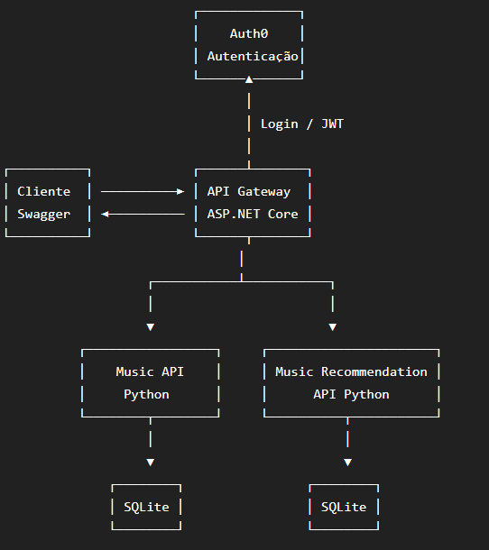

# Music API Gateway

API Gateway desenvolvida em **C# / ASP.NET Core 10**, responsável por centralizar as requisições da aplicação e integrar os serviços de catálogo e recomendação.

## Arquitetura

A aplicação utiliza uma arquitetura baseada em API Gateway, responsável pela autenticação dos usuários e pela comunicação com os demais serviços.



## Tecnologias

* C# / .NET 10
* ASP.NET Core Web API
* Swagger
* Auth0 / JWT
* Docker

## Autenticação

A autenticação é realizada pelo **Auth0**, utilizando tokens JWT.

Configure as variáveis:

```env
Auth0__Domain=SEU_DOMINIO_AUTH0
Auth0__Audience=https://music-api-gateway
```

> **Não inclua credenciais ou Client Secrets no repositório.**

## Executar com Docker

Clone o projeto:

```bash
git clone https://github.com/leoLUIGY/music-api-gateway.git
cd music-api-gateway
```

Crie a imagem:

```bash
docker build -t music-api-gateway .
```

Execute:

### PowerShell

```powershell
docker run -p 8080:8080 `
  -e "Auth0__Domain=SEU_DOMINIO_AUTH0" `
  -e "Auth0__Audience=https://music-api-gateway" `
  music-api-gateway
```

### Linux / macOS

```bash
docker run -p 8080:8080 \
  -e "Auth0__Domain=SEU_DOMINIO_AUTH0" \
  -e "Auth0__Audience=https://music-api-gateway" \
  music-api-gateway
```

## Swagger

Após iniciar o container, acesse:

```text
http://localhost:8080/swagger
```

Use o botão **Authorize** para informar um **Access Token JWT** do Auth0.
